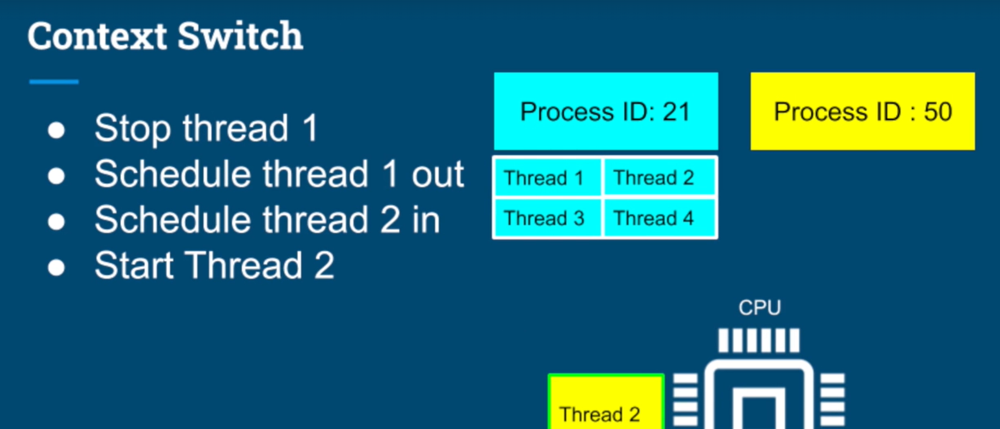
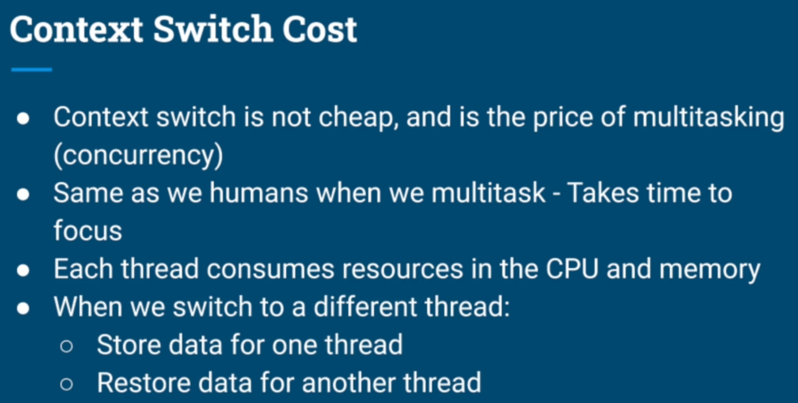
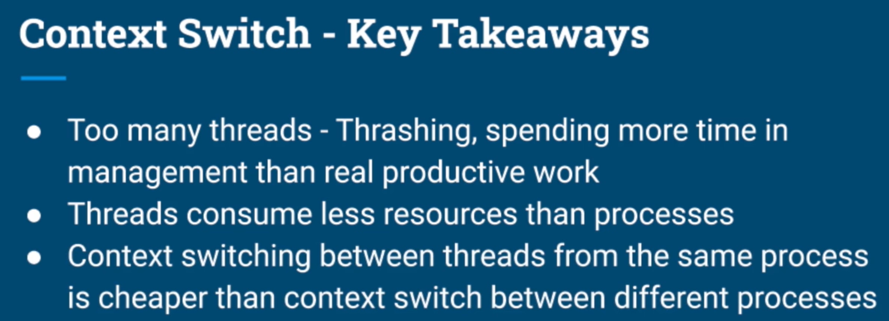
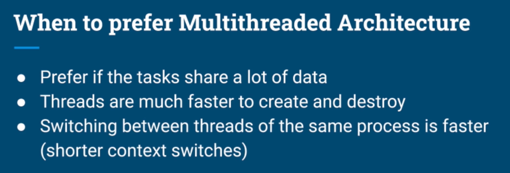

# NOTES

### Context switching

All processes may have one or more threads and all threads are competing beteween themselves to be executed on the CPU.

- This is the concept of the context switching:


- Costs:


- Key Takeaways:


---

### Thread Scheduling

It uses a dynamic priority (by using an epoch) for each thread.

It avoids starvation.


### Multithread x Multi-process




### Daemon threads

Background threads that don't prevent the application from exiting if the main thread terminates.

```
Thread t = new Thread(() -> {});
t.setDaemon(true);
```

- **scenarios**

  - Background tasks, that should not block our application from terminating. Eg.: file saving thread in a text editor.