# NOTES

### Context switching

All processes may have one or more threads and all threads are competing beteween themselves to be executed on the CPU.

- This is the concept of the context switching:
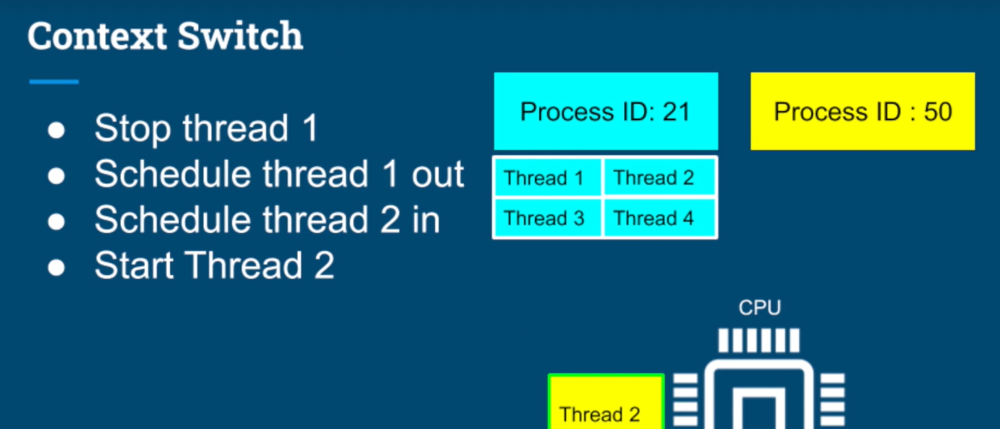

- Costs:
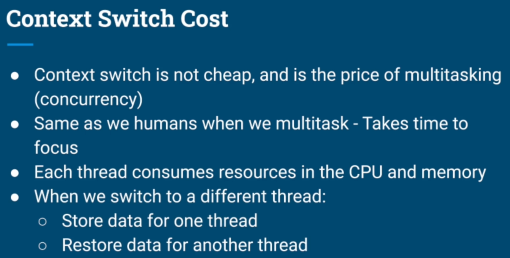

- Key Takeaways:
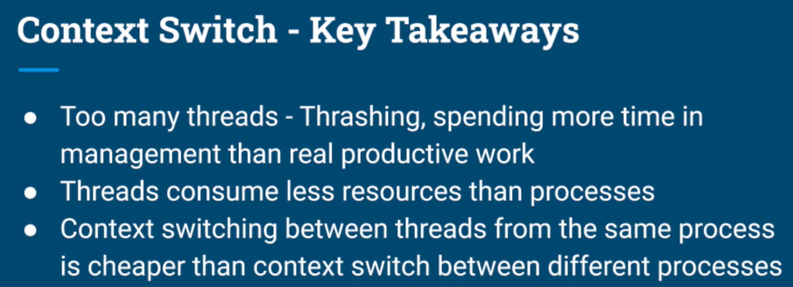

---

### Thread Scheduling

It uses a dynamic priority (by using an epoch) for each thread.

It avoids starvation.

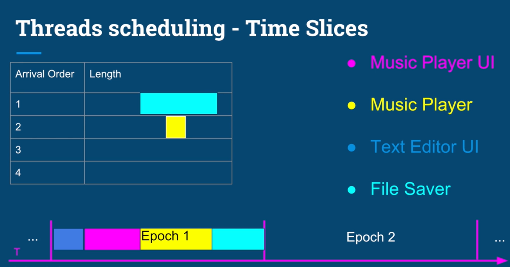

### Multithread x Multi-process

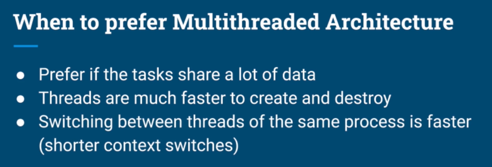


### Daemon threads

Background threads that don't prevent the application from exiting if the main thread terminates.

```
Thread t = new Thread(() -> {});
t.setDaemon(true);
```

- **Scenarios**

  - Background tasks, that should not block our application from terminating. Eg.: file saving thread in a text editor.

---

### Performance in multithreading

- **Latency** - the time completion of a task. Measured in time units.
- **Throughput** - the amount of tasks completed in a given period. Measured in tasks/time unit.

#### Analysis

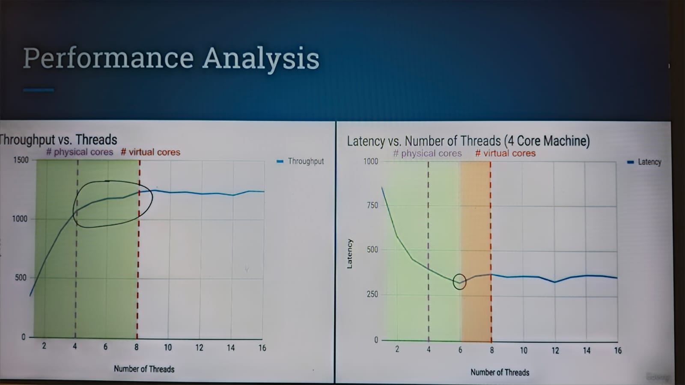

---

### Thread pooling (throughput)

Create threads once and reusing them for feature tasks instead of recreating the threads each and every time from scratch.

Once the threads are created, they sit in the pool and the tasks are distributed among the threads through a queue.

Each thread takes tasks from that queue whenever that thread is available. If all threads are busy, the tasks are going to stay in the queue and waiting for a thread to become available.

If we keep the threads well, busy and utilized, and feeding tasks into the queue, we can get the maximum throughput and maximum utilization.

This concept provided us a significant performance improvement.

In Java, we can use fixed thread pool executor:

```
int numberOfThreads = 4;
Executor e = Executors.newFixedThreadPool(numberOfThreads);

Runnable task = ...;
e.execute(task);
```

---

### Data sharing between threads

#### Stack (exclusive)

- Each stack region belongs to a particular thread;
  
- It's a memory region where:
  
  - methods are called;
  - arguments are passed;
  - local variables are stored.

- Stack + Instruction Pointer = state of each thread's execution.
  
- Example of a visible stack: debug a program and observe the variables console, where we can see the stack in action.

#### Heap (shared)

- It's a shared memory region that belongs to the process;
  
- Allocated on the heap:

  - Objects (anything created with *new* operator)
    - String
    - Object
    - Colletion
    - ...
  - Members of classes
  - Static variables

#### Objects x References

- **References**
  
  - Can be allocated on the **stack** (if declared as local variables inside a method);
  - Can be allocated on the **heap** with their parent object (if they are members of a class, eg.: attributes)

- **Objects**
  
  - Always allocated on the heap

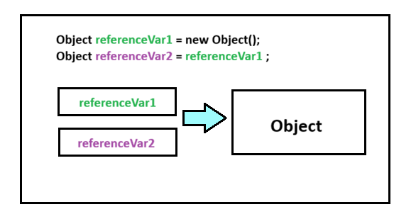

---

### Resource Sharing and Critical Regions

##### Resources sharing example:

- database microservice, where each thread processes an HTTP request and, in the end, all threads use the same database connection to perform operations.

#### Atomic Operations

- An operation or a set of operations is considered atomic, if it happens to the rest of the system as if it occured at once.
  
- Single step - "all or nothing".

- No intermediate states

- **Example:**

  - the variable **items++** **is not** an atomic operation
  
    - Get the current value of items
    - Increment the current value by 1
    - Store the result into items
    - Similar to: items = items + 1

#### Synchronization

- Use the **syncrhonized** keyword to protect the critical section in two ways
  
  - Simple way (in front of a method)
  - On a explicit object - more fexible and granular (keeps only the critical section as non concurrent), but also more verbose


#### What needs to be synchronized and what doesn't?

- All reference assignments are atomic
  
- We can get and set references to objects atomically
  
  - Example:
    ```
    Object a = new Object();
    Object b = new Object();
    a = b; // atomic
    ```
    

- Getters and setters are atomic and they don't need to be synchronized

- All assignments to primitive types are safe **except long and double**
  
- Assignments to long and double if  declared *volatile*

  - Example:
    ```
    volatile double x = 1.0;
    volatile double y = 9.0;
    x = y; // atomic
    ```

- https://docs.oracle.com/javase/specs/jls/se7/html/jls-17.html#jls-17.7

#### Race condition and data race

- **Race conditions**

  - Condition where threads are accessing a shared resource
  - The core of the problem is non atomic operations performed on the shared resource
  - **Example**: two threads accessing the same items++ variable without using the right method to avoid inconsistent (e.g.: synchronized keyword)

- **Data race**

  - Condition where threads are accessing independent resources (e.g.: variables x++ and y++) simultaneously, which may lead to unexpected, paradoxical and incorrect results during their execution, even if the final value for both variables is the same at the end of the process 
  - This is caused because the compiler and CPU may execute instructions out of the order to optmize performance and utilization. The mentioned behavior are important features to speed up the code 
  - **Solutions:** synchronization of methods which **modify shared variables** and declaration of shared variables with the *volatile* keyword (this will reduce overhead of locking and will guarantee order)

- **Summary**

  - Synchronized - solves both race condition and data race, but has a performance penalty
  - Volatile - solves race condition for read/write from/to long and double and solves all data races by guaranteeing order

#### Deadlocks

Deadlock is a situation where everyone is trying to make progress, but cannot because they're waiting for another part to make a move (circular dependency).

##### Example: railroad traffic control

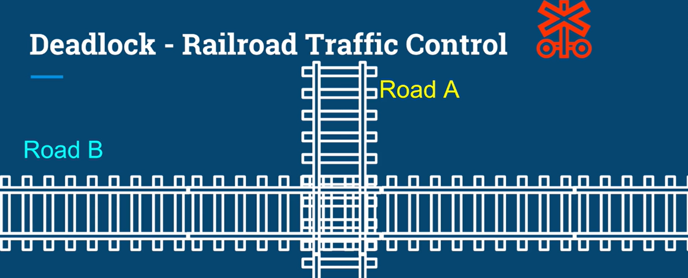

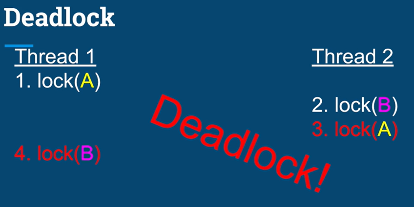

#### Conditions for a deadlock

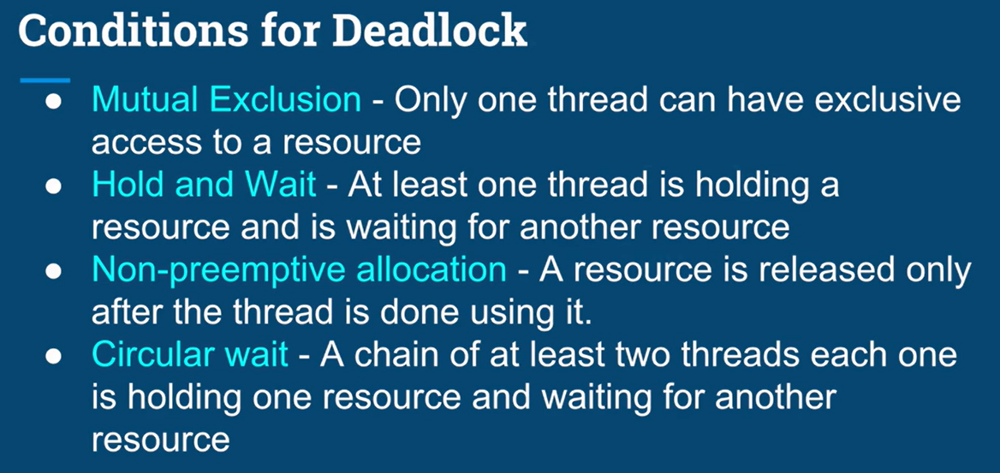

#### Solution


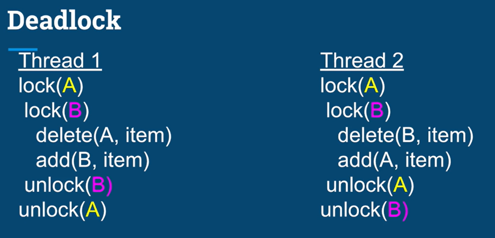

#### Conclusion

- Enforcing a strict order on lock acquisition
prevents deadlocks

- Easy to do with a small number of locks
  
- Maybe hard to accomplish if there are many locks in different places

- Other techniques:

  - Deadlock detection - Watchdog

  - Thread interruption (not possible with synchronized)

  - tryLock operations (not possible with synchronized)

---

### ReentrantLock

Reentrant meaning: a function or lock can be safely interrupted and called again (re-entered) before it finishes the first run.

- Works like a synchronized keyword
- Requires explicit locking and unlocking

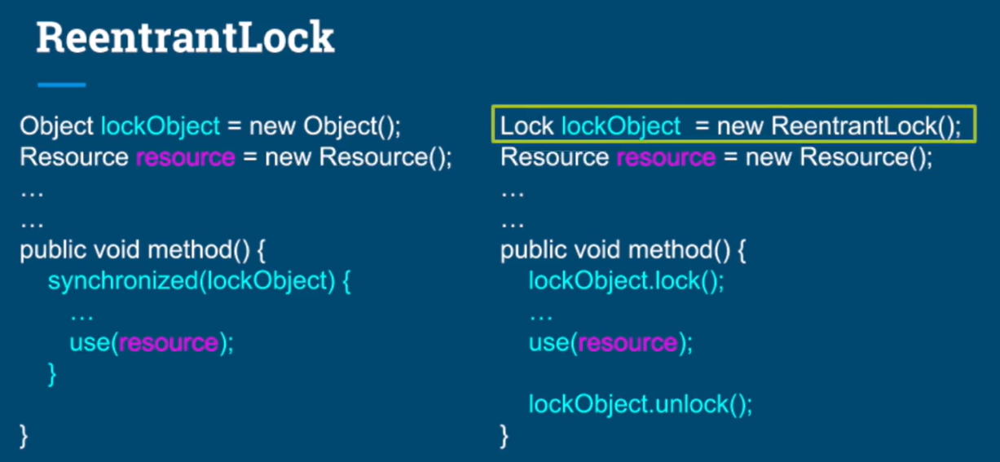

- Disadavantage

  - Forget to unlock the object at the end
  - Exception thrown before unlocking (solution: use finally statement)

- Advantage
  
  - Control over the lock
  - More lock operations

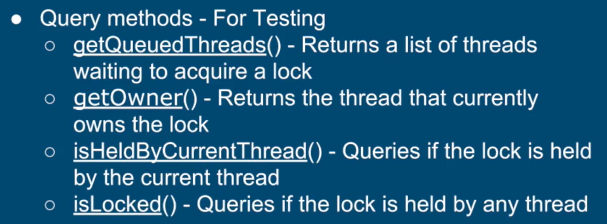


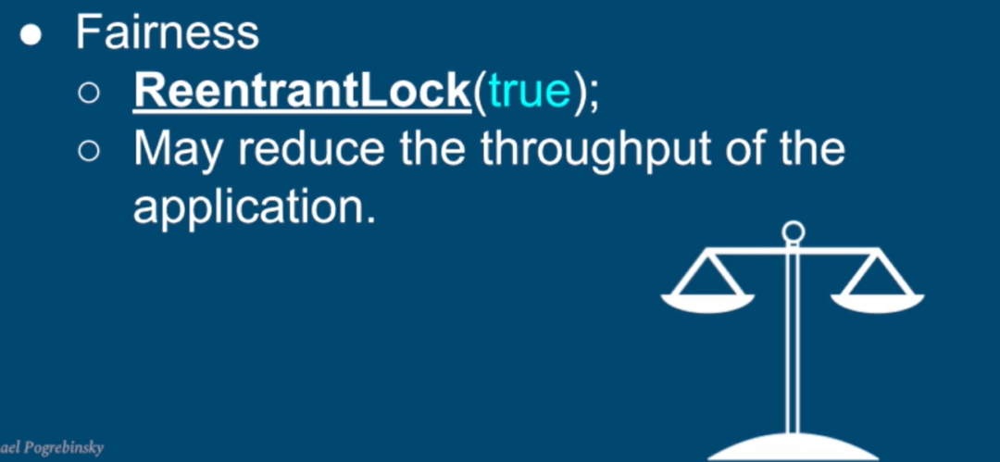

- ReentrantLock.lockInterruptibly()


- ReentrantLock.tryLock()

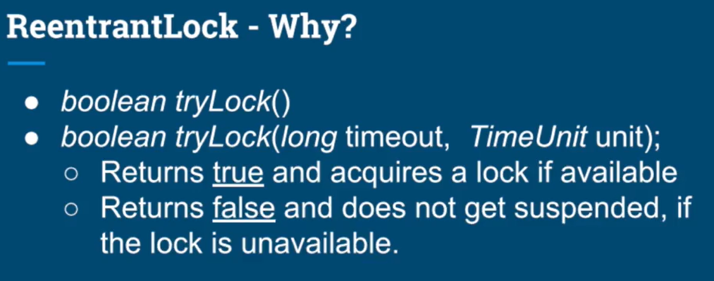

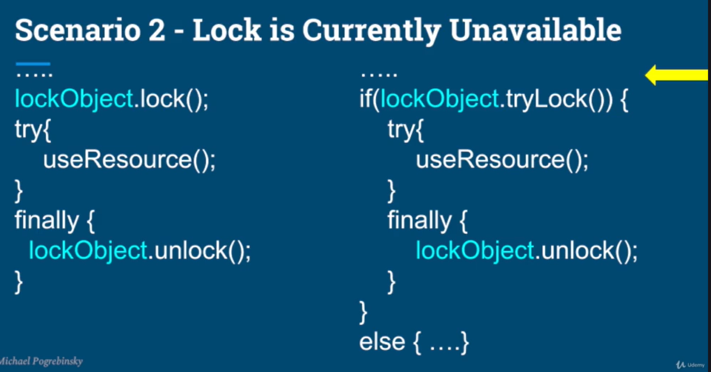

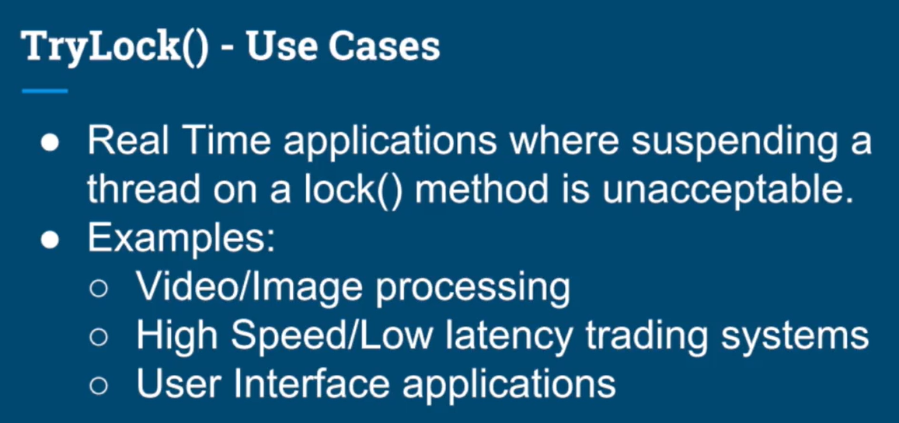

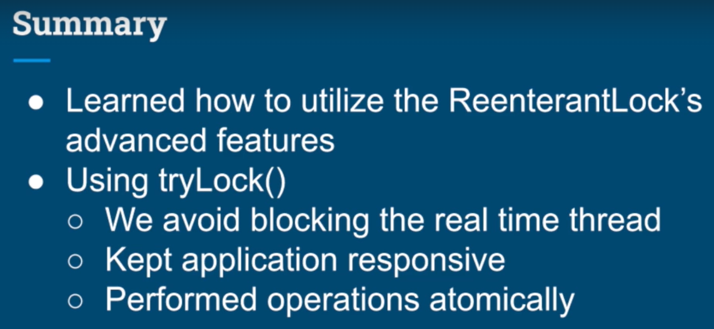

- ReentrantReadWriteLock (read and write lock)

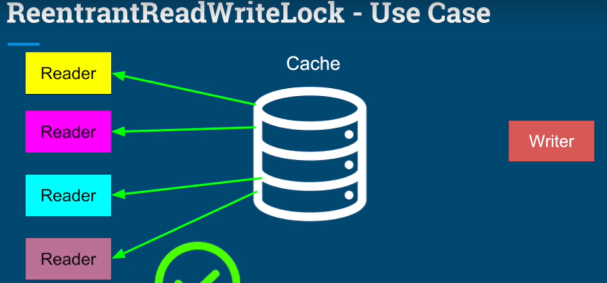

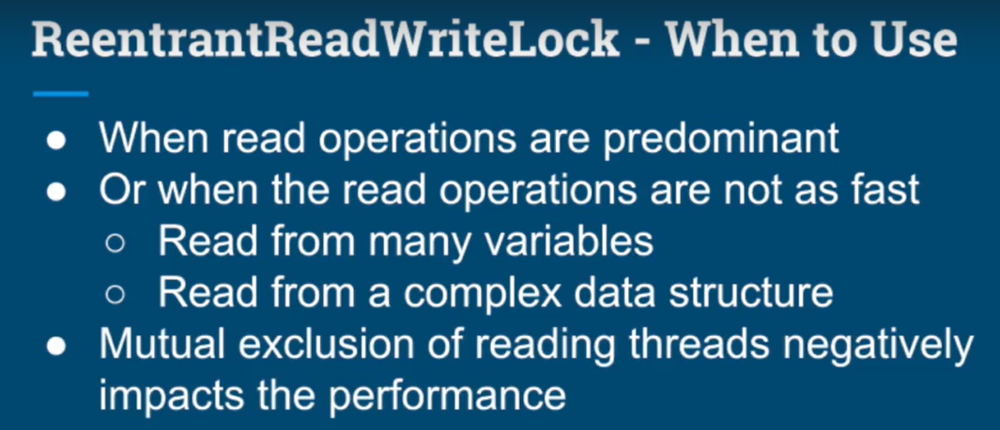

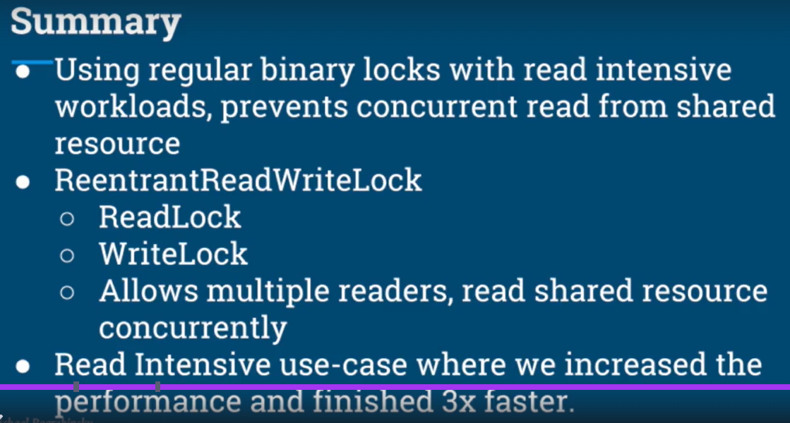


---

### Semaphore

- Can be used to restrict the number of "users" to a particular resource or a group of resources

- Unlike the locks that allows only one "user" per resource

- The semaphore can restrict any given number of users to a resource

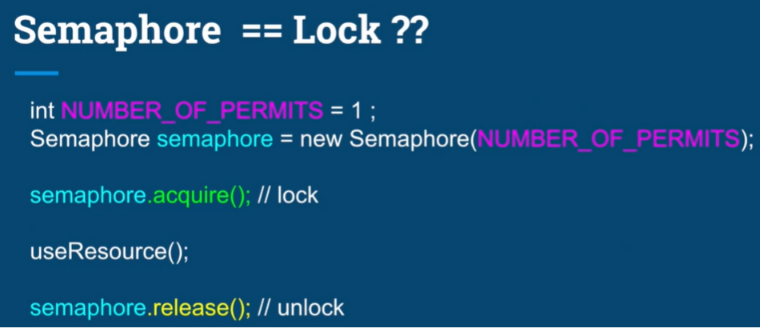


